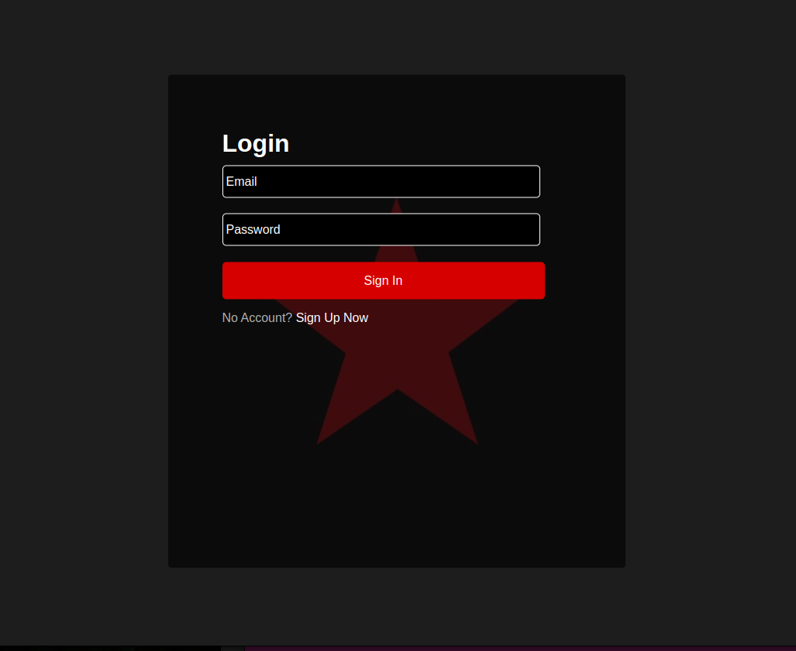
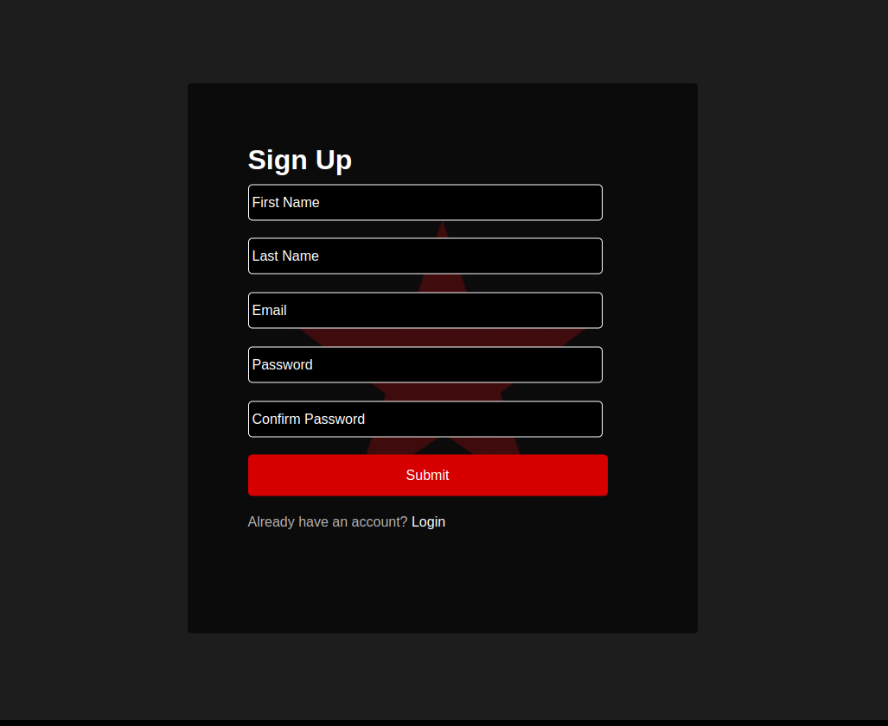
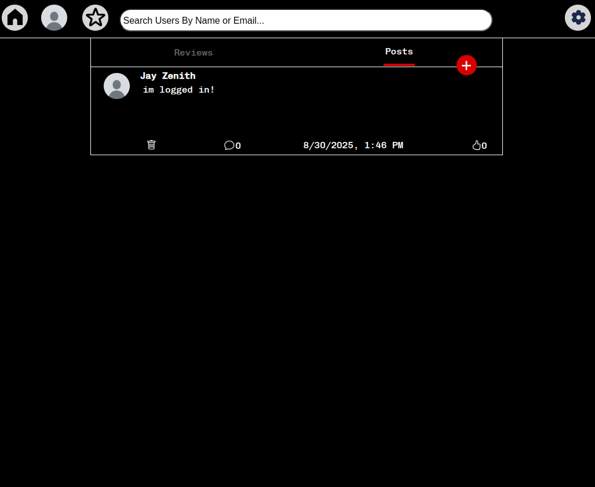
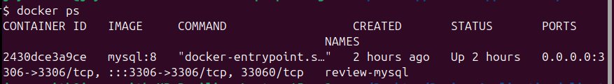
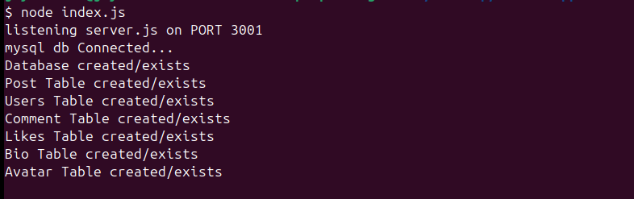
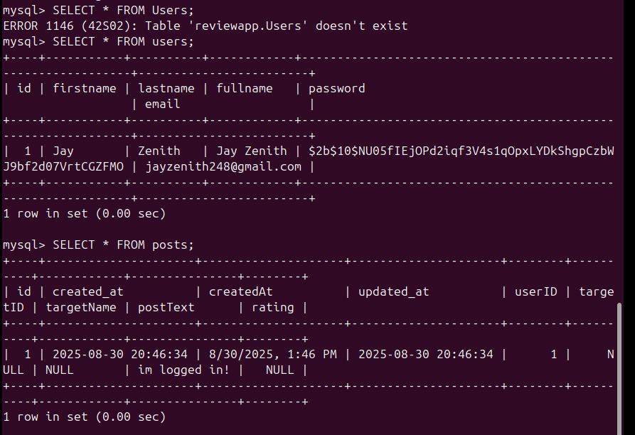

## **4️⃣ Review Application (First Fullstack Project)**

# Review Application

A full-stack web application for submitting, viewing, and managing user reviews.
Demonstrates practical web development, database integration, authentication, and REST API design.

## Features
- Users can create, read, update, and delete reviews (CRUD)
- MySQL backend for persistent storage
- React frontend with responsive UI
- REST API built with Express.js

> **Note:** This project works, but the server code is admittedly messy and not production-ready. There are multiple areas for improvement, including modularization, error handling, input validation, and overall structure. Consider this more of a proof-of-concept for learning rather than clean production code.

## Login Page


## Signup Page


## Home Page with Posts


## Running MySQL via Docker

## Server Running

## Querying the Database 


## Tech Stack
- Frontend: React.js
- Backend: Node.js + Express.js
- Database: MySQL
- Authentication: JWT, bcrypt
- File Uploads: multer
- Environment Variables: dotenv
- Styling: CSS

## Getting Started
1. Clone the repository:
```bash
   git clone https://github.com/JayZenith/Review-Application.git
   cd Review-Application
```

## Install backend dependencies:

```bash
cd server
npm install
```

## Install frontend dependencies:
```bash
cd ../client
npm install
```

## Create .env file with following
```bash
DB_HOST=localhost
DB_USER=your_mysql_user
DB_PASSWORD=your_mysql_password
REACT_APP_HTTP_REQ=http://localhost:3001
DB_NAME=review_app
ACCESS_TOKEN=your_jwt_secret
```


## Run backend server:
```bash
cd server
npm install
npm start

```


## Run frontend
```bash
cd ../client
npm install
npm start

```

- Open http://localhost:3000

## Backend Endpoints Overview

1. Authentication
- POST /signupFour → Register new users
- POST /login → Login and receive JWT token
- GET /auth → Validate JWT token
- PUT /changepassword → Update password
- DELETE /deleteAccount → Delete user account

2. Posts
- POST /posts → Create a post/review
- DELETE /deletePost/:deleteId → Delete a post
- GET /posts4 → Fetch posts with user info and likes
- GET /posts5 → Fetch posts with likes and comments

3. Comments
- POST /comments → Add a comment
- DELETE /deleteComment/:commentId → Delete a comment
- GET /comments3/:postId → Fetch comments for a post

4. Likes
- POST /likes → Like or unlike a post

5. Users
- GET /users → Fetch all users
- GET /users2 → Fetch users with avatars
- GET /users3 → Fetch users with avatars and bios
- GET /basicInfo/:id → Fetch basic user info

6. Avatars & Bio
- POST /upload → Upload avatar image
- GET /getAvatar/:id → Get user avatar
- POST /addBio → Add or update bio
- GET /getBio/:id → Fetch user bio
- POST /addUrlLink → Add profile link
- POST /deleteUrlLink/:id → Delete profile link


## Database Schema
1. Tables:
- users → User accounts and login info
- posts → Reviews submitted by users
- comments → Comments on posts
- likes → Likes on posts
- avatars → User profile images
- bio → User bios and profile links
The backend automatically creates the database and tables if they don’t exist.

## Why This Project Matters 
- Demonstrates full-stack capabilities from database to frontend.
- Shows ability to integrate authentication, file uploads, and complex queries.
- Provides a foundation for more advanced applications.
- Strong example of practical web development and working with relational databases.